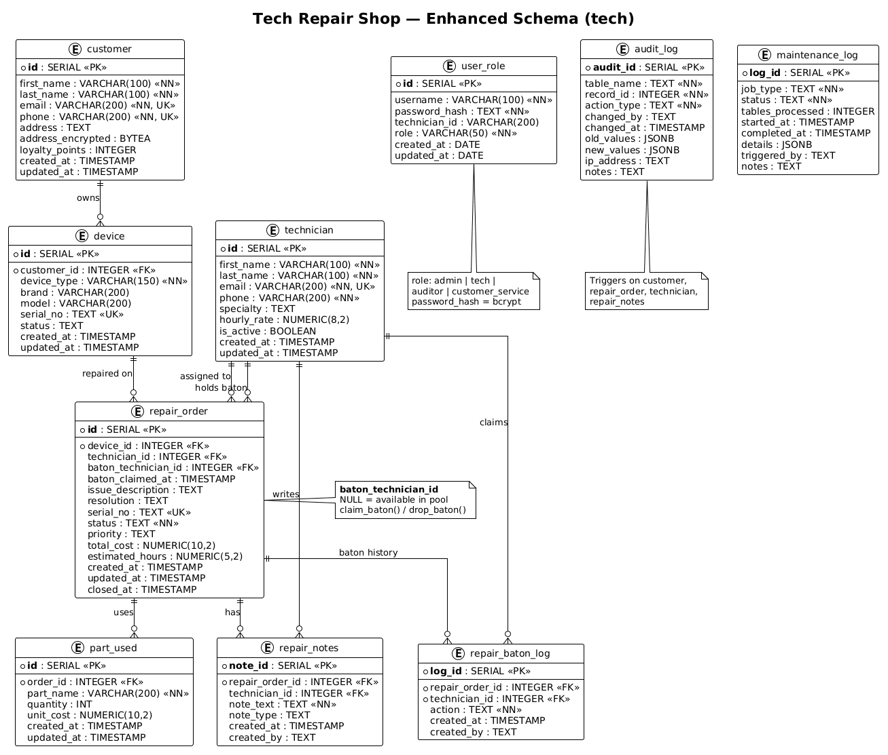

# Tech Repair Shop Database Project

A PostgreSQL database for a fictional tech repair business. The project starts with a normalized baseline schema (`original/`) and extends it with production-minded security, operations, and a thin web front end (`enhanced/`).

**Primary artifact:** the database and sysadmin tooling.  
**Secondary layer:** FastAPI at `/app` — a plain-language UI for customer service and technicians.

---

## Project layout

| Path | Purpose |
|------|---------|
| `original/` | Baseline schema, seed data, queries, indexes, and roles |
| `enhanced/sql/` | Incremental migrations applied on top of the baseline |
| `enhanced/ops/` | Backup/restore, migration, verification, and maintenance scripts |
| `enhanced/api/` | FastAPI app — browser UI at `/app`, JWT auth, role-scoped DB connections |
| `docs/` | Entity relationship diagram (`erd.png`) |

---

## Quick start

**Prerequisite:** PostgreSQL 17+ and local config files. Copy the examples if you have not already:

```bash
cp enhanced/ops/backup_config.env.example enhanced/ops/backup_config.env
cp enhanced/api/.env.example enhanced/api/.env
# Edit both files with your PostgreSQL username.
```

If the `original/` schema is not loaded yet, use `setup_environment.sh` below (it runs `original/` and all enhancements). Otherwise, migrate an existing baseline with `migrate_enhanced.sh`.

### 1. Apply enhancements

```bash
cd enhanced/ops
./migrate_enhanced.sh --db tech_shop
./verify_environment.sh --db tech_shop
```

### 2. Start the web app

```bash
cd enhanced/api
source ../../venv/bin/activate
uvicorn main:app --reload
```

Open **http://127.0.0.1:8000/app** — pick a role, choose a user, password auto-fills.

API smoke tests: `cd enhanced/api && ./test_api.sh` (server must be running).

---

## How the shop works

Customers bring devices in for repair. Each device links to a customer record; each repair ticket tracks the issue, parts used, cost, status, and assigned technician.

**Baton workflow** — only one technician actively holds a ticket at a time. Claiming the baton starts work; dropping it returns the ticket to the shared pool for anyone to pick up. Closing a ticket auto-drops the baton and logs the event.

**Four app roles**, each backed by a PostgreSQL login:

| Login role | Who | What they can do |
|------------|-----|------------------|
| `cs_login` | Customer service | See all customers and repairs; add notes |
| `tech_login` | Technician | Claim/drop batons; add notes while holding; see relevant ticket history |
| `admin_login` | Administrator | Full CRUD, decrypt addresses, run maintenance |
| `auditor_login` | Auditor | Read-only on operations; full audit trail access |

Change history lands in `audit_log`. Maintenance jobs log to `maintenance_log`.

---

## Schema

All objects live in the `tech` schema on database **`tech_shop`**.

### Tables

| Table | Description |
|-------|-------------|
| `customer` | Contact info, loyalty points, encrypted address (`address_encrypted`) |
| `device` | Customer-owned hardware with serial and status |
| `technician` | Staff profiles with specialty, hourly rate, active flag |
| `repair_order` | Repair ticket — status, priority, cost, assignee, baton holder |
| `part_used` | Parts and unit cost per repair |
| `repair_notes` | Timestamped notes per ticket |
| `repair_baton_log` | Claim / drop / auto-drop history |
| `user_role` | App logins with bcrypt `password_hash` and role |
| `audit_log` | JSONB snapshots on INSERT/UPDATE/DELETE |
| `maintenance_log` | Analyze, reindex, MV refresh, and optional VACUUM jobs |

### Reporting views

| View | Purpose |
|------|---------|
| `technician_performance` | Repairs, revenue, and averages per technician |
| `repair_aging` | Open-ticket counts and age by status and priority |

### Entity relationship diagram



---

## Security

- **bcrypt passwords** in `user_role` (plain `password` column removed after migration)
- **Encrypted addresses** at rest via pgcrypto; `v_customer_contact` masks email/phone for technicians
- **Row-level security** on `repair_order`, `repair_notes`, `repair_baton_log`, `audit_log`, and `user_role`
- **Audit triggers** on `customer`, `repair_order`, `technician`, and `repair_notes`
- **Explicit grants** per role; `PUBLIC` revoked on schema objects

Technicians see a repair if they hold the baton, the baton is unclaimed on an open ticket, or they previously interacted (claim log or note). Session context (`app.technician_id`) is set at login.

Source files: `enhanced/sql/security_hardening.sql`, `enhanced/sql/customer_service_role.sql`, `enhanced/sql/baton_system.sql`

### Baton functions

| Function | Purpose |
|----------|---------|
| `tech.claim_baton(repair_id)` | Atomic claim; moves Open → In Progress |
| `tech.drop_baton(repair_id)` | Release baton back to the pool |
| `clear_baton_on_close()` trigger | Auto-drops baton and logs `AUTO_DROP` on close |

---

## Operations

Config lives in `enhanced/ops/backup_config.env` (connection settings, `PG_BIN_DIR`).

### Day-to-day

| Script | Purpose |
|--------|---------|
| `migrate_enhanced.sh --db tech_shop` | Apply enhancements to an existing baseline DB |
| `run_maintenance.sh --scheduled` | Default path: ANALYZE + materialized-view refresh when needed |
| `run_maintenance.sh --vacuum` | Optional VACUUM ANALYZE via shell (not inside SQL functions) |
| `backup_db.sh` | Full backup (also `--schema-only`, `--data-only`) |
| `restore_db.sh <file>` | Restore from backup (`--force` skips prompt) |

### From scratch / CI

| Script | Purpose |
|--------|---------|
| `setup_environment.sh --db NAME --fresh --skip-roles` | Load `original/` + all `enhanced/sql/` into a new database |
| `verify_environment.sh --db NAME` | Schema, seed data, views, and backup dry-run checks |
| `test_all.sh` | Full suite: provision staging, verify, security + maintenance tests |

`migrate_enhanced.sh` and `setup_environment.sh` run the same enhancement SQL in order, ending with customer service role and baton system.

---

## Web app (`/app`)

No Swagger UI — the browser page is the product.

| Role | Experience |
|------|------------|
| Customer service | Shop-wide repairs and customers; filters; add notes |
| Technician | Baton buckets: queue, holding, available, my open, my closed |
| Administrator | Shop stats, revenue snapshot, maintenance status |
| Auditor | Read-only panels plus recent audit entries |

### Demo accounts

| Username | Password | Role |
|----------|----------|------|
| `cs_jordan` | `cs123` | Customer service |
| `tech_tom` | `pass123` | Technician |
| `tech_sara` | `pass123` | Technician |
| `tech_jake` | `pass123` | Technician |
| `admin_mary` | `admin123` | Administrator |
| `audit_alex` | `audit123` | Auditor |

Rich sample data (~35 customers, ~42 repairs, notes, parts, baton history) loads via `enhanced/sql/rich_sample_data.sql`.

---

## SQL scripts

### Baseline (`original/`)

| File | What it does |
|------|--------------|
| `table_creation.sql` | Core six tables |
| `trigger_creation.sql` | `updated_at` and `closed_at` automation |
| `roles.sql` | Initial login roles and grants |
| `seed_data.sql` | Starter rows |
| `indexes.sql` | Email/phone, status, composite, and full-text GIN indexes |
| `queries.sql` | Twelve demonstration queries (joins, aggregation, reporting) |

### Enhancements (`enhanced/sql/`)

| File | What it adds |
|------|--------------|
| `schema_enhancements.sql` | Priority, cost, technician specialty/rate columns |
| `audit_logging.sql` | `audit_log` table and change triggers |
| `add_repair_notes.sql` | `repair_notes` table |
| `analytics_reporting.sql` | Materialized views and revenue function |
| `performance_monitoring.sql` | Index usage and table health views |
| `security_hardening.sql` | bcrypt, encryption, RLS, role grants |
| `maintenance_automation.sql` | `maintenance_log` and scheduled job functions |
| `api_access_grants.sql` | Permissions for the FastAPI layer |
| `demo_data_boost.sql` / `rich_sample_data.sql` | Realistic shop data |
| `customer_service_role.sql` | `cs_login` role and front-desk policies |
| `baton_system.sql` | Baton columns, log, claim/drop functions, tech RLS |

Triggers added beyond the baseline: `log_audit_changes()` (audit) and `clear_baton_on_close()` (baton). Enhancement migrations also add indexes on priority, baton holder, and note lookups.

Re-run the twelve queries in `original/queries.sql` after migration to see results against the richer dataset.

---

## Course objectives met

- **Normalization** — customers, devices, orders, parts, and notes in separate tables (3NF)
- **Constraints** — PKs, FKs, CHECK, and UNIQUE across core and enhancement tables
- **Role-based security** — four login roles with RLS and explicit grants
- **Triggers** — timestamps, close automation, audit, baton auto-drop
- **Analytics** — materialized views and monthly revenue function
- **Maintenance** — logged ANALYZE/REINDEX automation; optional VACUUM via ops script
- **ACID design** — FK enforcement, atomic baton claim/drop functions